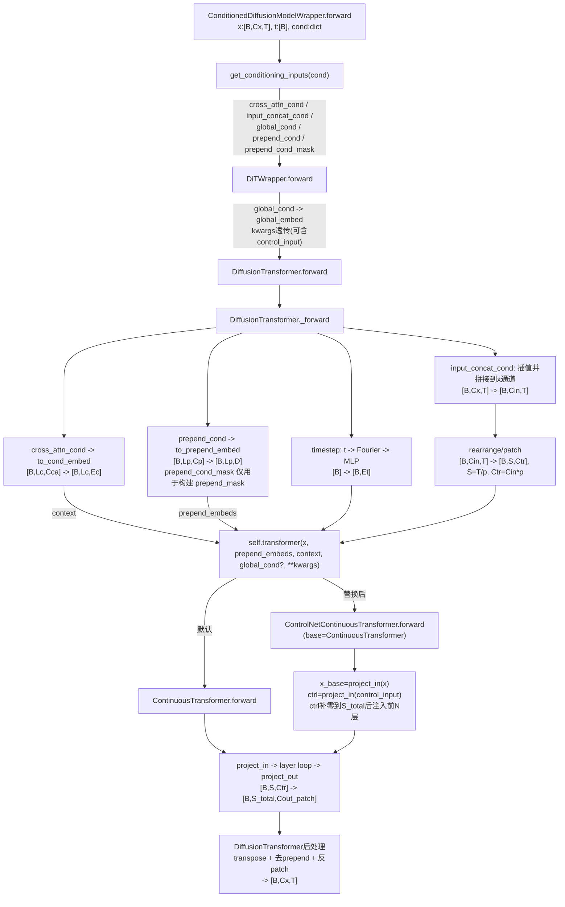
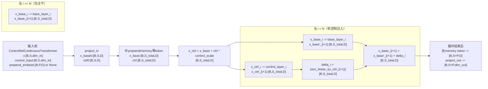

# StableAudio 调用链 + ControlNet 位置 + 变量形状图

## 规划与假设
- 以 `diffusion_model_type='dit'` 路径为主（`ConditionedDiffusionModelWrapper -> DiTWrapper -> DiffusionTransformer -> ContinuousTransformer`）。
- 形状里使用符号：`B`(batch), `Cx`(io_channels), `T`(latent length), `p`(patch_size), `S=T/p`, `D`(embed_dim), `M`(memory tokens), `P`(prepend token count), `S_total=M+P+S`。
- `ControlNetContinuousTransformer` 作为替换点挂在 `model.model.model.transformer`。

## 调用链图（含变量连接）

## 关键变量形状变化表
| 变量 | 关键路径 | 形状变化（关键节点） | 证据等级 |
|---|---|---|---|
| `x` | Wrapper -> DiT -> (ControlNet)Transformer | `[B,Cx,T] -> [B,Cin,T] -> [B,T,Cin] -> [B,S,Ctr] -> [B,S_total,D] -> [B,S_total,Cout_patch] -> [B,Cx,T]` | 源码+配置推断 |
| `t` | `DiffusionTransformer._forward` | `[B] -> [B,1] -> Fourier:[B,256] -> timestep_embed:[B,Et]` | 源码+配置推断 |
| `cross_attn_cond` | `get_conditioning_inputs` -> `_forward` | `cat后 [B,Lc,Cca] -> to_cond_embed后 [B,Lc,Ec]` | 源码+配置推断 |
| `context` | `_forward` -> TransformerBlock/Attention | `context = cross_attn_cond(投影后), 形状维持 [B,Lc,Ec]` | 源码可证 |
| `input_concat_cond` | Wrapper -> `_forward` | `[B,Cconcat,Tc] -> (插值到T) -> 与x通道拼接成 [B,Cin,T]` | 源码+配置推断 |
| `global_embed` | `DiTWrapper.forward` -> `_forward` | `global_cond:[B,G] -> to_global_embed:[B,Eg]`，再与 `timestep_embed` 组合（prepend/adaLN 分支） | 源码+配置推断 |
| `prepend_cond` | Wrapper -> `_forward` | `[B,Lp,Cp] -> to_prepend_embed:[B,Lp,D]`，可再拼接全局token得到 `[B,P,D]` | 源码+配置推断 |
| `prepend_cond_mask` | Wrapper -> `_forward` | `[B,Lp]`，可与全1 mask拼成 `[B,P]`；当前 transformer 路径不直接消费该 mask | 源码可证 |
| `prepend_embeds` | `_forward` -> (ControlNet)Transformer | 入参 `[B,P,D]`；与 token 拼接后 `[B,P+S,D]` | 源码可证 |
| `control_input` | `ControlNetContinuousTransformer.forward` | 期望与 transformer `x` 同形 `[B,S,Ctr]`，`project_in -> [B,S,D]`，补零到 `[B,S_total,D]` 后逐层注入 | 源码+配置推断 |

## 关键源码定位（便于复核）
- `ConditionedDiffusionModelWrapper` 与条件路由：`.venv/Lib/site-packages/stable_audio_tools/models/diffusion.py:100`
- `get_conditioning_inputs(...)`：`.venv/Lib/site-packages/stable_audio_tools/models/diffusion.py:137`
- `DiTWrapper.forward(...)`：`.venv/Lib/site-packages/stable_audio_tools/models/diffusion.py:520`
- `DiffusionTransformer` 与 `_forward`：`.venv/Lib/site-packages/stable_audio_tools/models/dit.py:12`
- `_forward` 中 input_concat 插值拼接：`.venv/Lib/site-packages/stable_audio_tools/models/dit.py:160`
- `_forward` 中 token 化与 transformer 调用：`.venv/Lib/site-packages/stable_audio_tools/models/dit.py:195`
- `ContinuousTransformer.forward(...)`：`.venv/Lib/site-packages/stable_audio_tools/models/transformer.py:796`
- `TransformerBlock` 的 cross-attn 入口：`.venv/Lib/site-packages/stable_audio_tools/models/transformer.py:662`
- `Attention` 中 `kv_input = context if has_context else x`：`.venv/Lib/site-packages/stable_audio_tools/models/transformer.py:457`
- `ControlNetContinuousTransformer`（本地实现）：`stable_audio_control/models/control_transformer.py:1`

## 按层展开图（Layer i：x_base / x_ctrl / zero_linear_i）

### Layer-i 变量表（注入阶段）
| 变量 | 第 i 层前 | 第 i 层后 | 备注 |
|---|---|---|---|
| `x_ctrl` | `[B,S_total,D]` | `control_layer_i(x_ctrl)` 后仍 `[B,S_total,D]` | 仅 `i < N` 时更新 |
| `x_base` | `[B,S_total,D]` | `base_layer_i(x_base)` 后仍 `[B,S_total,D]` | 所有层都会更新 |
| `zero_linear_i(x_ctrl)` | 输入 `[B,S_total,D]` | 输出 `[B,S_total,D]` | `Linear(D,D)`，逐token线性映射 |
| `x_base + zero_linear_i(...)` | 两项均 `[B,S_total,D]` | 结果 `[B,S_total,D]` | 这是 ControlNet 的注入点 |

### 初始化与训练语义（关键）
- `zero_linear_i` 是 zero-init（权重和偏置全 0），因此训练初期通常 `delta_i≈0`，模型行为接近原始主干。
- 只有训练让 `zero_linear_i` 和 `control_layers` 学到非零后，`control_input` 才会稳定影响输出。
- 这就是你在 smoke 里看到 `diff norm==0`（zero-init）以及“手动扰动后 `diff norm>0`”的根因。

### 对接 DiT 时的最重要形状约束
- 进入 `ControlNetContinuousTransformer` 的 `x` 来自 DiT token 化后张量，形状是 `[B,S,dim_in]`。
- `control_input` 必须与它同形：`[B,S,dim_in]`。
- 若你从 latent 特征构造控制输入，先确保最终映射到 `S` 和 `dim_in` 两个维度完全一致。

