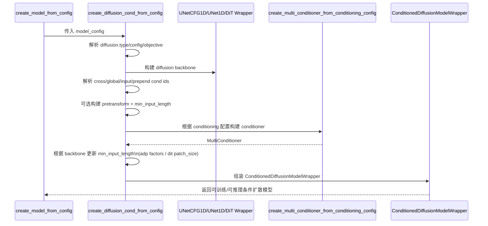
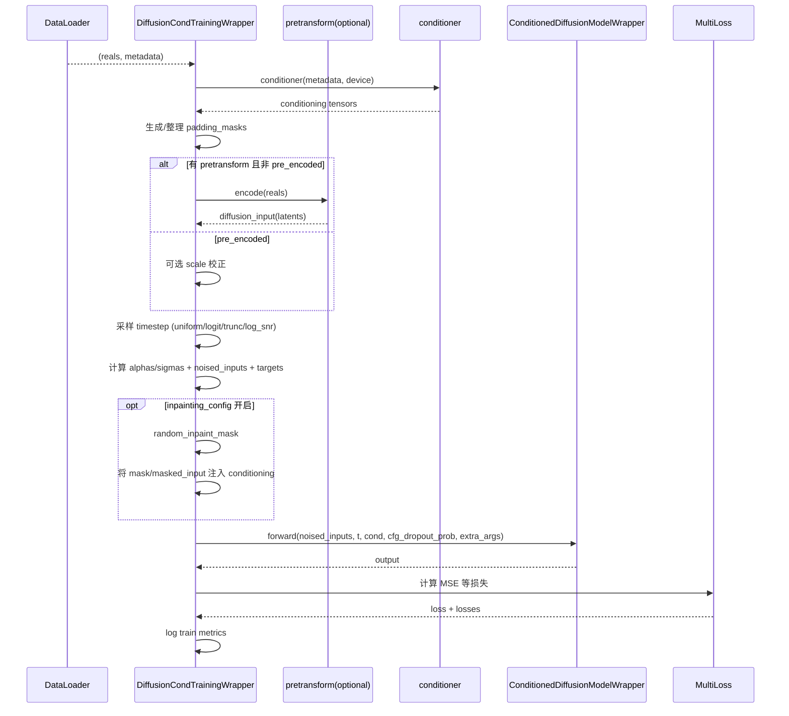
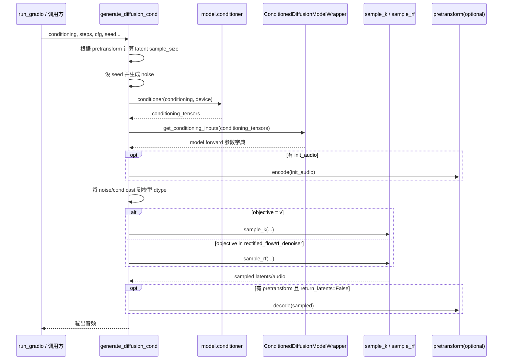

# stable-audio-tools Diffusion 深潜

## 读者对象
需要深入理解 `models/diffusion.py` 与 `training/diffusion.py` 实际调用路径的开发者。

## 本文覆盖范围
聚焦两个核心文件：
- [`stable_audio_tools/models/diffusion.py`](../../stable_audio_tools/models/diffusion.py)
- [`stable_audio_tools/training/diffusion.py`](../../stable_audio_tools/training/diffusion.py)

重点包括模型构建、条件张量组装、训练 step 细节、推理生成链路和 demo 回调机制。

## 3分钟速读版
- `models/diffusion.py` 主要解决“模型怎么拼”和“条件怎么映射”。
- `training/diffusion.py` 主要解决“噪声目标怎么构造”和“损失怎么算”。
- 条件扩散训练核心链路：metadata -> conditioner -> `get_conditioning_inputs` -> model forward。
- 推理核心链路：conditioning -> sampler(`sample_k`/`sample_rf`) -> 可选 pretransform decode。

## 1. 文件职责划分

### `models/diffusion.py` 负责
1. 定义 diffusion backbone 包装层（`UNet*Wrapper`, `DiT*Wrapper`）。  
2. 定义 `DiffusionModelWrapper` / `ConditionedDiffusionModelWrapper`。  
3. 把“业务条件字典”转成模型前向参数（`get_conditioning_inputs`）。  
4. 根据配置构建扩散模型（`create_diffusion_uncond_from_config`, `create_diffusion_cond_from_config`）。  

### `training/diffusion.py` 负责
1. 定义训练包装器（无条件/条件/扩散自编码器）。  
2. 定义训练与验证 step 的噪声构造、目标构造、损失计算。  
3. 管理 EMA 更新与导出。  
4. 定义 demo 回调（普通条件、inpaint 条件等）。  

## 2. 构建链路时序图（`create_diffusion_cond_from_config`）

关键实现点：
- `diffusion.type` 决定 backbone 分支：`adp_cfg_1d` / `adp_1d` / `dit`。  
- `min_input_length` 会叠加：
  - pretransform 下采样比；
  - ADP 的 `factors` 乘积或 DiT 的 `patch_size`。  
- `distribution_shift_options` 会构建 `DistributionShift` 并挂在 wrapper 上。  

## 3. 条件张量组装机制（`get_conditioning_inputs`）

`ConditionedDiffusionModelWrapper.get_conditioning_inputs(...)` 的核心逻辑：

1. `cross_attn_cond_ids`：按序列维拼接；若输入是 `[B, C]` 会先扩到 `[B, 1, C]`。  
2. `global_cond_ids`：按通道维拼接，必要时 squeeze。  
3. `input_concat_ids`：按通道维拼接，期望 `[B, C, T]`。  
4. `prepend_cond_ids`：按序列维拼接 `prepend_cond` 和 `prepend_cond_mask`。  
5. `negative=True` 时返回 `negative_*` 字段，用于 CFG 负条件。  

常见坑：
- 条件 `id` 对不上：metadata key、conditioner id、`*_cond_ids` 三者必须一致。  
- 形状对不上：尤其是 input concat 与 prepend。  

## 4. 训练 step 时序图（`DiffusionCondTrainingWrapper.training_step`）

实现细节：
- `timestep_sampler` 支持 `uniform`, `logit_normal`, `trunc_logit_normal`, `log_snr`。  
- 若配置 `dist_shift`，会调用 `time_shift(t, seq_len)` 调整时间采样分布。  
- `diffusion_objective` 决定目标定义：
  - `v`：目标为 `noise * alpha - data * sigma`
  - `rectified_flow` / `rf_denoiser`：目标为 `noise - data`  
- `cfg_dropout_prob` 在训练前向中用于 classifier-free dropout。  

## 5. 验证 step 与 EMA

### 验证 step
`validation_step` 与训练类似，但：
1. 使用固定 `validation_timesteps`（默认 `[0.1, 0.3, 0.5, 0.7, 0.9]`）。  
2. `cfg_dropout_prob=0`。  
3. 结果累积到 `validation_step_outputs`，在 `on_validation_epoch_end` 聚合并记录。  

### EMA
`on_before_zero_grad` 会更新 `self.diffusion_ema`（如果启用）。  
导出时 `export_model` 使用 EMA 权重替换在线模型（若启用 EMA）。

## 6. 推理链路时序图（`generate_diffusion_cond`）

实现细节：
- 函数支持 `conditioning` 或直接传 `conditioning_tensors`。  
- 支持负条件 `negative_conditioning`，并通过 `negative_*` 字段参与 CFG。  
- `objective` 不同会切不同采样函数，且 `sample_rf` 分支会清理不适用参数（如 `sigma_min`, `rho`）。  

## 7. Demo 回调差异（训练中在线采样）

### `DiffusionCondDemoCallback`
1. 可使用固定 `demo_conditioning`，也可从 batch 抽取。  
2. 为每个 `cfg_scale` 生成 demo。  
3. 对 `v` / `rectified_flow` / `rf_denoiser` 使用不同采样路径。  
4. 可选展示条件音频和混音结果。  

### `DiffusionCondInpaintDemoCallback`
相比普通条件 demo，额外：
1. 生成随机 inpaint mask。  
2. 注入 `inpaint_mask` 与 `inpaint_masked_input` 到 conditioning。  
3. 采样后输出 inpaint demo 结果。  

## 8. 调参时最值得优先观察的开关

1. `diffusion_objective`：决定训练目标与采样路径。  
2. `timestep_sampler`：直接影响训练分布。  
3. `cfg_dropout_prob`：影响 CFG 能力学习。  
4. `p_one_shot`：将部分样本固定到 `t=1`。  
5. `distribution_shift_options`：影响时序分布偏移。  
6. `demo_cfg_scales`：帮助可视化条件强度与音质/可控性平衡。  

## 9. 变更建议（针对 diffusion 内核）

如果你要改 diffusion 内核，建议按顺序验证：
1. `create_diffusion_cond_from_config` 可正常构建模型。  
2. `training_step` 单步前向+反向能跑通。  
3. `validation_step` 不报错且能产生日志。  
4. `DiffusionCondDemoCallback` 能生成音频。  
5. `generate_diffusion_cond` 离线推理链路可跑。  

## 10. 相关文档
- 全局视图： [架构总览](./architecture-overview.md)
- 训练实操： [训练流程](./training-pipeline.md)
- 推理实操： [推理与 UI](./inference-and-ui.md)
- 常见报错： [排障手册](./troubleshooting.md)
